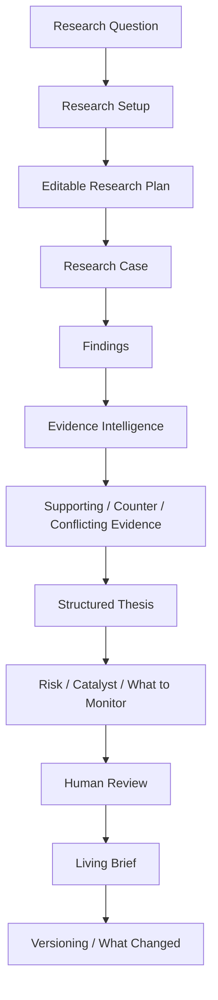
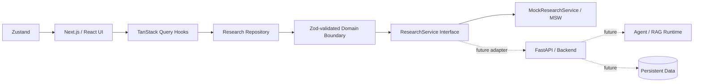

# Atlas Research Workspace

**Evidence-first investment research workspace for AI, robotics, and embodied intelligence**

> **Portfolio case study · Frontend-first P0 prototype**  
> Built to show how a professional VC / PE / strategic-research workflow can be translated into an AI-native internal product without collapsing the process into a generic chat interface.

Atlas structures research around **questions, evidence, counter-evidence, thesis formation, human review, and versioned living briefs**. The current P0 is intentionally frontend-first: product semantics, information architecture, review controls, and backend-replaceable boundaries are implemented; live retrieval, RAG, agent runtime, persistence, and market-data integrations are planned rather than implied.

## Product preview


*Design reference for the implemented P0 workspace. Research content in the current demo is clearly labelled mock data by design.*

## 30-second product tour

Once the app is running, the fastest way to understand Atlas is:

1. **New Research** — create a research question, choose scope, targets, time range, and source types.
2. **Research Case** — review and edit the research plan, then start the staged research-run experience.
3. **Evidence Intelligence** — inspect supporting, counter, conflicting, and unverified evidence with source context.
4. **Thesis & Decision Workspaces** — connect evidence to assumptions, disconfirming conditions, risks, catalysts, and monitoring items.
5. **Human Review** — approve, reject, challenge, edit, or request more research with an audit-visible review history.
6. **Living Brief & Versioning** — maintain a structured brief and inspect what changed across research versions.

### Run locally

```bash
pnpm install
pnpm dev
```

Then open `http://localhost:3000`.

## Why Atlas

Professional investment and strategic research is not a one-shot prompting problem. Analysts need to:

- decompose an open-ended question into a research plan;
- collect and inspect evidence before writing conclusions;
- keep **supporting evidence and counter-evidence** separate;
- make assumptions and disconfirming conditions explicit;
- retain human control over claims and thesis changes;
- update research as new evidence arrives instead of regenerating a static report.

Atlas turns that workflow into a structured product rather than a chat transcript.

## Core workflow



The product principle is simple:

> **Evidence before prose. Human judgment before final decision.**

## Implemented vs planned

| Area | Implemented in P0 | Planned / intentionally deferred |
| --- | --- | --- |
| Research workflow | New Research, editable plan, Research Case, staged research progress, structured findings | Live multi-source research execution |
| Evidence | Supporting / counter / conflicting evidence, source context, verification states, claim review | Live source ingestion and retrieval |
| Decision support | Company Research, structured thesis, assumptions, disconfirming conditions, risks, catalysts, monitoring items | Continuous monitoring and thesis-change detection |
| Human control | Claim/evidence review, request-more-research actions, review queue, audit trail, brief approval | Multi-user permissions and collaboration |
| Outputs | Living Brief, version history, structured version diff, What Changed | Production export pipeline |
| Library | Searchable/filterable research library | Persistent document store |
| Application architecture | Typed domain schemas, repository boundary, service interface, query/mutation layer, mock transport | FastAPI/backend adapters |
| AI runtime | Product semantics and UI contracts only | RAG, LangGraph/agent runtime, live model/tool orchestration |
| Data | Explicitly labelled mock research data | Database persistence, live market/company/source data |
| Security | Frontend interaction/accessibility states | Authentication and production authorization |

## Architecture



The key design choice is the replaceable service boundary:

```text
Page / Feature Component
        ↓
TanStack Query Hook
        ↓
Repository
        ↓
Zod-validated typed domain contract
        ↓
ResearchService
        ↓
Mock transport today / backend adapter later
```

UI components do not import fixtures directly, and pages do not call transport implementations directly. This keeps product code independent from the current mock backend.

## Implemented product capabilities

### Research planning and execution
- Research setup with scope, targets, time range, source types, and attachment state.
- Editable prioritized research plan.
- Cancellable / restartable staged research-run simulation.
- Progressive structured findings with confidence, supporting signals, and evidence counts.

### Evidence intelligence
- Separate supporting and counter-evidence treatment.
- Verification states: `Verified`, `Partially Supported`, `Conflicting`, `Needs Review`, `Rejected`.
- Source provenance and citation context.
- Claim approve / reject, evidence-status changes, and request-more-research interactions.
- Audit-visible analyst actions.

### Decision workspaces
- Company research across technology, commercialization, competition, talent, funding, and risk.
- Structured thesis with assumptions, linked evidence, counter-evidence, and disconfirming conditions.
- Risk, catalyst, and monitoring workspaces.

### Human review and living outputs
- Human Review queue and audit trail.
- Structured Living Brief with executive summary, thesis, findings, evidence, counter-evidence, risks, catalysts, open questions, and analyst notes.
- Version history with structured diffs and `What Changed`.
- Searchable/filterable Research Library.

## Technical stack

**Frontend**
- Next.js 16
- React 19
- TypeScript
- Tailwind CSS 4
- Radix UI primitives

**State and data flow**
- TanStack Query
- Zustand
- Zod
- MSW

**UI / interaction**
- TanStack Table / Virtual
- React Hook Form
- Motion
- Lucide

**Testing**
- Vitest
- React Testing Library
- Playwright

## Verification

The P0 implementation was checked through:

- ESLint;
- strict TypeScript;
- production Next.js build;
- unit/component coverage across repository contracts and stateful workspace interactions;
- a complete Chromium P0 flow;
- mobile-navigation smoke coverage.

The documented frontend verification includes **15 unit/component tests** plus browser-path validation.

## Product boundaries

Atlas is intentionally **not** presented as a production investment-research agent today.

The current P0 does **not** claim to include:

- a production backend or database;
- live web / filing / paper / market-data retrieval;
- RAG;
- LangGraph or another production agent runtime;
- authentication;
- autonomous investment decisions or trading;
- continuous monitoring.

Those boundaries are deliberate. The current repository focuses on proving the **professional research workflow, evidence semantics, human-control model, and product architecture** before introducing a live AI runtime.

## Portfolio role

Atlas demonstrates a different capability from the other portfolio systems:

| Project | Primary role |
| --- | --- |
| **Atlas Research Workspace** | Professional research workflow design, product engineering, evidence/counter-evidence semantics, human review, versioned research state |
| **FinEvidence / Financial QA work** | Financial retrieval, evidence eligibility, provenance, hard-negative reliability |
| **Enterprise Agent systems** | Agent orchestration, tools, semantic layers, execution reliability |
| **LLM post-training work** | SFT, preference/reward modeling, RL, evaluation |

Atlas is therefore best read as a **product-engineering and workflow-translation case study**: turning a complex professional process into a structured, auditable, backend-ready AI workspace.

## Source of truth

- [P0 Product Spec](docs/product/P0_PRODUCT_SPEC.md)
- [Repository guidance](AGENTS.md)
- [Frontend-first OpenSpec](openspec/changes/frontend-first-workspace-foundation/)
- [Web application](apps/web/)

## Historical consolidation

Earlier investment-research prototypes are preserved under `legacy_imports/` and are not the source of truth for the current P0 product.

See [repository consolidation notes](docs/repository-consolidation-2026-09-10.md).
